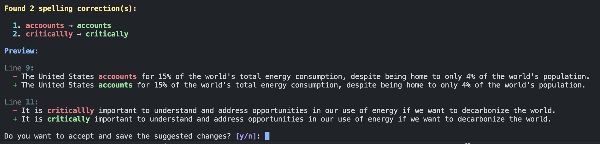

# proofer

**⚠️ This is experimental and a work in progress.**

A very simple CLI-based agent built with LangGraph for proofreading and editing short-form writing like blog posts. Displays a helpful git-like diff with suggestions and the option to automatically apply changes with backups.



## User Guide

### OpenAI API Key

You'll need to set the `OPENAI_API_KEY` environment variable. An easy way to do this is to put this line:

```
export OPENAI_API_KEY=<your key>
```

in your `.zshrc` file or whichever configuration file your setup uses.

### Install

TODO

### Usage

TODO

## Development

This project currently requires Python 3.13 ([pyenv](https://realpython.com/intro-to-pyenv/) is recommended) and uses Poetry as the dependency manager and packaging tool.

For now, checkout the `Makefile` as a guide.

| Command      | Description              |
| ------------ | ------------------------ |
| make install | Install all dependencies |
| make test    | Run unit tests           |
